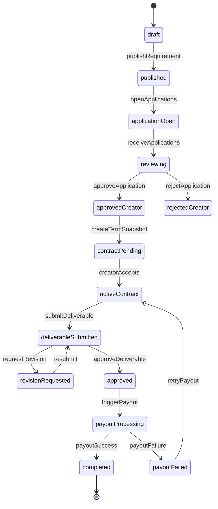

# India Creator Marketplace MVP Plan (Lean Scope)

## 1) Product Scope (Updated)
Build a responsive web-first, India-only two-sided marketplace where brands post collaboration requirements and creators apply if eligible, with brand-side approval workflows, deliverable submission, and payout tracking. MVP supports mixed compensation models (barter, fixed fee, per-1,000 views, or combinations), commission on paid payouts, and compliance-ready placeholders (GST/TDS/KYC), while deferring subscription monetization and chat/negotiation modules.

## 2) Core User Stories

### Creator
- Sign up/login (email/phone + OAuth where applicable), select role, complete profile.
- Connect Instagram, import baseline account metrics, and display portfolio.
- Discover requirements and apply to opportunities where eligibility criteria are met.
- Accept approved terms, upload deliverables, receive approval feedback, and track payout status.
- View earnings history and invoice/tax placeholders (GST/TDS fields).

### Business
- Sign up/login, complete business profile and verification basics.
- Create requirement postings with eligibility filters (e.g., gender, follower threshold, niche, geography) and compensation model.
- Review creator applications in an approval window (approve/reject/waitlist) and finalize selected creators.
- Approve deliverables, trigger payouts, and view invoice/tax placeholders.
- Track campaign performance and spend analytics.

### Admin
- Moderate users/campaigns/contracts, flag abuse/fraud, and resolve disputes.
- Manage payout exceptions, commissions, and platform announcements.
- Access operations dashboards (GMV, conversion, payout lag, disputes).

## 3) Feature Priority (MVP-First)

### P0 (Launch-blocking)
- Auth + RBAC (Creator/Business/Admin).
- Creator and Business profile CRUD.
- Requirement creation/listing/search/filter.
- Eligibility filter engine (gender, followers min, engagement min optional, platform, location, niche).
- Application flow + status tracking.
- Brand approval management window (approve/reject/waitlist/bulk actions).
- Contract/term snapshot generation from requirement + selected compensation model.
- Deliverable submission + approval/revision loop.
- Payout orchestration + commission capture records for paid components.
- Notification center (in-app + email).
- Admin moderation basics.

### P1 (Early post-launch)
- Instagram Graph enrichment depth (scheduled sync, trend snapshots).
- Invoice PDF generation + reconciliation UX.
- Basic reporting dashboards for all roles.

### P2 (Scale)
- Subscription plans + feature gating (advanced proposal templates, boosted visibility, premium analytics).
- Negotiation and in-app chat module.
- Recommendation/matching engine.
- Escrow variants / milestone payouts.
- Automated dispute workflows.
- Advanced compliance automation and tax exports.

## 4) Recommended Tech Stack (Fast in Cursor, scalable later)
- Frontend: Next.js (App Router) + TypeScript + Tailwind + shadcn/ui.
- Backend: Next.js API routes for MVP OR modular Node service (NestJS) if team expects rapid backend growth. For speed: start with Next.js + service layer abstraction.
- DB: PostgreSQL.
- ORM: Prisma.
- Auth: Clerk or Auth.js + custom role tables (Clerk fastest for MVP).
- File storage: AWS S3 or Cloudflare R2 (signed URLs for uploads).
- Queue/async jobs: Upstash Redis + QStash or BullMQ (for stat sync, notifications, payout webhooks).
- Payments (India): Razorpay (collections + transfers), with abstraction layer for future provider swaps.
- Email/notifications: Resend + in-app notification table.
- Observability: Sentry + basic structured logs.
- Deploy: Vercel (web/API) + managed Postgres (Neon/Supabase/RDS).

## 5) Data Model (MVP Schema)
- users(id, email, phone, role, status, created_at)
- creator_profiles(user_id FK, full_name, bio, gender, niches[], city, state, rates_json, instagram_handle, follower_count, avg_engagement, kyc_status)
- business_profiles(user_id FK, legal_name, brand_name, gstin_placeholder, website, category, billing_email, verification_status)
- requirements(id, business_id FK, title, brief, platforms[], content_type, deliverable_count, application_deadline, start_date, end_date, status)
- requirement_eligibility(id, requirement_id FK, gender_allowed[], min_followers, min_engagement_rate, allowed_locations[], niches[])
- compensation_models(id, requirement_id FK, has_barter, barter_notes, fixed_fee_amount, cpv_rate_per_1000_views, currency)
- applications(id, requirement_id FK, creator_id FK, pitch, status, applied_at, decision_at, decision_reason)
- contracts(id, requirement_id FK, creator_id FK, business_id FK, application_id FK, terms_snapshot_json, status, accepted_at)
- deliverables(id, contract_id FK, creator_id FK, file_url, file_type, submitted_at, status, feedback)
- performance_reports(id, contract_id FK, creator_id FK, source, views_count, submitted_at, verified_at, status)
- payouts(id, contract_id FK, fixed_component_amount, cpv_component_amount, gross_amount, commission_amount, net_amount, payout_provider, payout_ref, status, released_at)
- invoices(id, payout_id FK, invoice_no, gst_amount_placeholder, tds_amount_placeholder, issued_at)
- notifications(id, user_id FK, type, title, body, read_at)
- audit_logs(id, actor_user_id, entity_type, entity_id, action, metadata_json, created_at)
- admin_flags(id, entity_type, entity_id, reason, status, assigned_admin_id)

## 6) API / Module Breakdown
- auth-module: signup/login/session/role guards.
- profile-module: creator/business profile CRUD + verification markers.
- requirement-module: create/update/publish/list/search.
- eligibility-module: filter definition and applicant eligibility checks.
- application-module: apply/withdraw/approve/reject/waitlist + bulk actions.
- contract-module: term snapshot + acceptance lifecycle.
- deliverable-module: upload links, submission, approve/revision requests.
- payment-module: payout calculation (fixed/cpv mix), webhook handling, payout trigger, commission ledger.
- social-module: Instagram connect + stats sync jobs.
- notification-module: in-app feed + email dispatch.
- admin-module: moderation queues, disputes, operational metrics.
- analytics-module: role-specific KPI endpoints.

## 7) Pages / Screens (Responsive Web)
- Public: Home, How it works, Pricing, Login/Signup.
- Creator: Onboarding, Profile edit, Requirement feed, Requirement detail, Application form, Contract detail, Deliverables, Earnings, Notifications, Settings.
- Business: Onboarding, Profile edit, Requirement list, Create/edit requirement, Applicants approval window, Contract detail, Deliverables review, Payments/Invoices, Analytics, Notifications, Settings.
- Admin: Moderation queue, User management, Requirement review, Contract/payout exceptions, Dispute center, Platform metrics.

## 8) Workflow / State Diagram (Requirement + Approval + Contract)

## 9) Payment Flow Design (India MVP)
- Support compensation as: barter only, fixed fee only, CPV only (INR per 1,000 views), or mixed model.
- For paid components (fixed/CPV), platform computes commission (configurable %) and stores ledger entry.
- Net creator payout initiated via payout API after deliverable approval and performance verification (for CPV).
- Generate invoice records with GST/TDS placeholders (manual override by admin initially).
- Keep payout states explicit: pending -> processing -> paid -> failed/reversed.
- Support manual reconciliation screen for failed webhooks or bank failures.

## 10) Admin Panel Requirements
- Moderation queues: users, requirements, deliverables, reports.
- KYC/verification review status controls.
- Payout operations: retry, hold, release, failure notes.
- Commission configuration.
- Tax placeholder fields management + export CSV.
- Dispute ticket lifecycle and audit logs.
- KPI dashboard: signups, active requirements, apply-to-approval conversion, GMV, commission revenue, payout SLA.

## 11) Launch Checklist
- Product readiness: P0 flows tested end-to-end for both roles.
- Security: RBAC checks on every API route, signed upload URLs, webhook signature validation.
- Reliability: retry logic for webhook/payout jobs, dead-letter handling.
- Compliance-ready: capture consent logs, KYC status flags, GST/TDS placeholder schema, invoice numbering.
- Analytics: baseline events for funnel tracking.
- Ops: admin runbooks for payout failures/disputes.
- GTM: onboarding guidance for brands to set good eligibility filters and compensation rules.
- Post-launch: monitor activation, payout failure rate, requirement fill rate, and creator retention weekly.

## 12) Suggested MVP Build Sequence (8-12 weeks)
- Sprint 1-2: Auth, RBAC, profile onboarding.
- Sprint 3-4: Requirements, eligibility filters, applications, approval window.
- Sprint 5-6: Contract snapshots, deliverables.
- Sprint 7-8: Payments/payouts (fixed + CPV), commission ledger, notifications.
- Sprint 9: Admin moderation + analytics baseline.
- Sprint 10+: Hardening + launch QA; then add subscriptions and chat/negotiation in next phase.