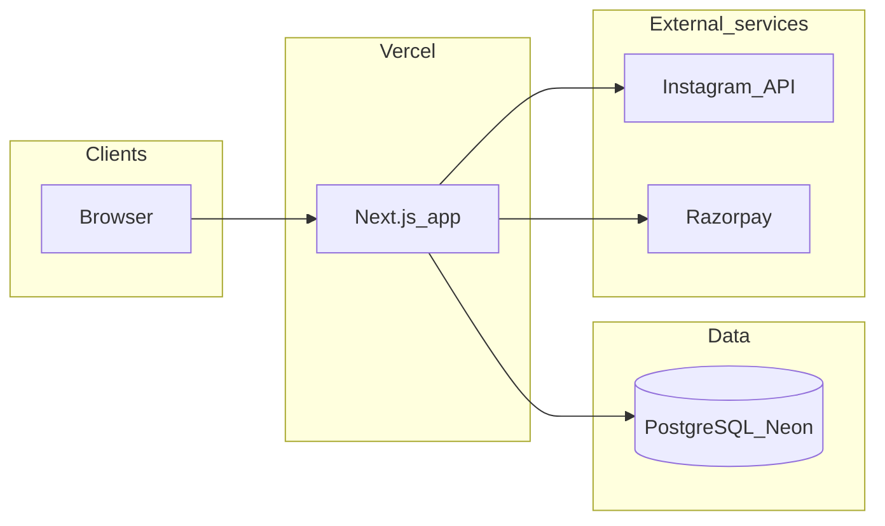
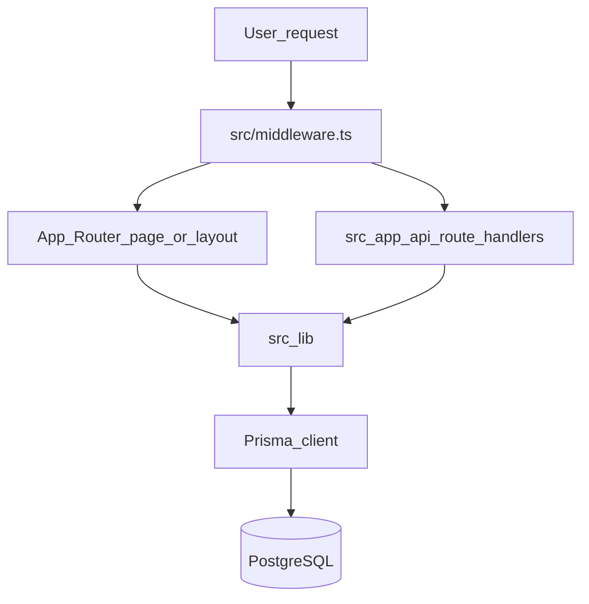
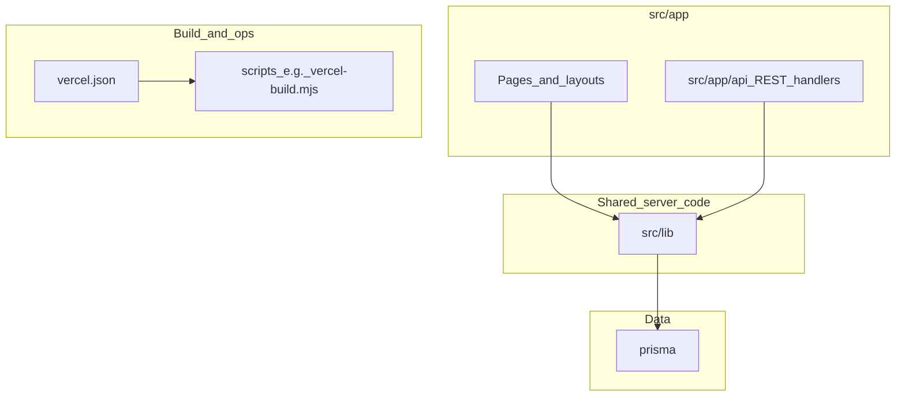
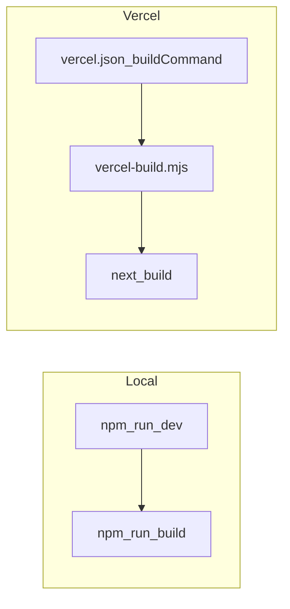

# Knowledge Transfer (Walnut Marketplace)

This document is the **first stop** for agents working on this repo. It explains how the system is structured and how work flows, without replacing deep dives into specific bugs or features.

**Reading order**

1. This file (big picture).
2. [HOSTING_AND_MIGRATIONS.md](./HOSTING_AND_MIGRATIONS.md) for env vars, Neon/Prisma, and Vercel build behavior.
3. [README.md](./README.md) for setup commands and project notes.
4. [Make New Version.md](./Make%20New%20Version.md) when you need to ship production from the CLI and sync Git.

---

## Tech stack

- **Framework:** Next.js (App Router), React, TypeScript
- **Styling:** Tailwind CSS
- **Data:** PostgreSQL (hosted, e.g. Neon) via **Prisma** ([`prisma/schema.prisma`](./prisma/schema.prisma))
- **Hosting:** Vercel ([`vercel.json`](./vercel.json)); build pipeline uses [`scripts/vercel-build.mjs`](./scripts/vercel-build.mjs)
- **Integrations (see `src/lib`):** session auth, Instagram OAuth, Razorpay (payments/webhooks), internal metrics sync (cron)

---

## High-level architecture

---

## Request path (typical)

Authenticated **app sections** (`/creator/*`, `/business/*`, `/admin/*`) pass through [`src/middleware.ts`](./src/middleware.ts): it checks for the `walnut_session` cookie and redirects to `/login?next=…` if missing. Full session verification and **role** checks happen in route handlers and layouts, not only in middleware.

**Important:** Middleware `matcher` only includes `/creator`, `/business`, and `/admin` trees (see [`src/middleware.ts`](./src/middleware.ts)). Public routes like `/`, `/login`, `/signup` are not gated by this cookie check in middleware.

---

## Repository layout (what lives where)

The **Git repository** may have the Next.js app in a subfolder named `walnut-marketplace/` (repo root one level above `package.json`). Vercel **Root Directory** is often set to that subfolder—see [Make New Version.md](./Make%20New%20Version.md) for where to run `vercel deploy` from.

| Area | Role |
|------|------|
| [`src/app`](./src/app) | App Router: UI routes (`page.tsx`, `layout.tsx`) |
| [`src/app/api`](./src/app/api) | HTTP API: one `route.ts` per verb/path segment |
| [`src/lib`](./src/lib) | Server utilities: DB (`db.ts`), auth (`auth.ts`), payments, Instagram, validation, analytics, etc. |
| [`src/lib/creator-niches.ts`](./src/lib/creator-niches.ts) | Curated niche list (50 slugs) for creator profiles; eligibility matching uses the same string slugs in seed data |
| [`src/middleware.ts`](./src/middleware.ts) | Edge middleware: session cookie presence for protected path prefixes |
| [`prisma/`](./prisma) | `schema.prisma`, migrations |
| [`scripts/vercel-build.mjs`](./scripts/vercel-build.mjs) | Vercel build: `migrate deploy` (when `VERCEL=1`), `generate`, `next build` |

---

## Product surfaces (routes)

Roles are modeled in Prisma as `UserRole`: `CREATOR`, `BUSINESS`, `ADMIN`.

| Surface | Example paths | Notes |
|---------|----------------|-------|
| **Public** | `/`, `/login`, `/signup` | Not in middleware matcher |
| **Creator** | `/creator`, `/creator/opportunities`, `/creator/deals`, `/creator/profile`, … | Cookie required (middleware) |
| **Business** | `/business`, `/business/requirements`, `/business/applications`, `/business/deals/board`, … | Cookie required; applications list shows follower count (not engagement %) |
| **Admin** | `/admin`, `/admin/operations` | Cookie required |

---

## API surface (namespaces)

Handlers live under [`src/app/api`](./src/app/api). Grouped by URL prefix (not every route listed):

| Prefix | Purpose |
|--------|---------|
| `/api/auth/*` | Login, signup, logout, session (`me`), password, Instagram OAuth start/callback |
| `/api/creator/*` | Applications, deals, earnings, opportunities, projects, profiles |
| `/api/profiles/creator` | GET/PUT creator profile (niches 1–5, gender `male`/`female`/`other`, etc.) |
| `/api/profiles/creator/sync-instagram` | POST: refresh display name, follower/post counts, profile photo (hybrid Graph + public web—see below) |
| `/api/business/*` | Applications, contracts, deals board, deliverables, payouts, profiles |
| `/api/admin/*` | Flags, metrics, moderation, payout reconciliation |
| `/api/applications`, `/api/requirements`, `/api/deliverables` | Cross-cutting marketplace entities |
| `/api/analytics/*` | Tracking and overview |
| `/api/notifications` | User notifications |
| `/api/webhooks/razorpay` | Payment provider webhooks |
| `/api/payouts/trigger` | Payout automation |
| `/api/internal/metrics/sync` | Cron target (see [`vercel.json`](./vercel.json)) |
| `/api/health`, `/api/debug/*` | Ops / debugging |

---

## Domain model (Prisma)

Core **models** in [`prisma/schema.prisma`](./prisma/schema.prisma) include:

- **Identity:** `User` (role: creator / business / admin), `CreatorProfile`, `BusinessProfile`
- **Marketplace:** `Requirement`, `RequirementEligibility`, `CompensationModel`, `Application`, `Contract`
- **Delivery & money:** `Deliverable`, `Payout`, `Invoice`, `BarterShipment`, `PerformanceReport`, `MetricSnapshot`
- **Compliance & ops:** `ConsentRecord`, `Notification`, `AuditLog`, `AdminFlag`

Enums define statuses for requirements, applications, contracts, deliverables, payouts, etc.

**Creator profile (not exhaustive):** `CreatorProfile` stores Instagram linkage (`instagramUserId`, `instagramUsername`, encrypted token), **`followerCount`**, **`postCount`**, **`instagramStatsSyncedAt`**, **`instagramProfilePictureUrl`**, niches as string slugs (1–5 from the curated list), and **`gender`** as plain strings (`male`, `female`, `other`). **`avgEngagement`** remains on the model for **eligibility** logic with opportunities; it is not edited on the creator profile UI.

**Creator profile UI** ([`src/app/creator/profile/page.tsx`](./src/app/creator/profile/page.tsx)): default **view** mode with an **Edit profile** action; **Save profile** appears only in edit mode. Gender is a dropdown; niches are chosen via a dropdown that adds up to five removable chips.

---

## Build and deploy

- **Local dev:** `npm run dev` (see [`package.json`](./package.json)).
- **Vercel:** `vercel.json` sets `buildCommand` to `npm run vercel:build`. When `VERCEL=1`, [`scripts/vercel-build.mjs`](./scripts/vercel-build.mjs) runs `prisma migrate deploy`, then `prisma generate`, then `next build`.

Details and env requirements: [HOSTING_AND_MIGRATIONS.md](./HOSTING_AND_MIGRATIONS.md).

**CLI production deploy** (when not relying on Git integration alone): run from the **repository root** that matches your Vercel project’s Root Directory—see [Make New Version.md](./Make%20New%20Version.md) so the CLI does not build the wrong folder.

---

## Cross-cutting concerns (pointers)

| Concern | Where to look |
|---------|----------------|
| Sessions / cookies | [`src/lib/auth.ts`](./src/lib/auth.ts), middleware |
| Database access | [`src/lib/db.ts`](./src/lib/db.ts) |
| Instagram OAuth & Graph | [`src/lib/integrations/instagram.ts`](./src/lib/integrations/instagram.ts) — OAuth, `fetchInstagramIdentity`, `fetchInstagramGraphMeFields` (`/me` for name, counts, optional profile picture) |
| Instagram public / hybrid sync | [`src/lib/integrations/instagram-public-profile.ts`](./src/lib/integrations/instagram-public-profile.ts) — `fetchInstagramProfileForSync` merges **Graph** (when a stored OAuth token exists) with **public web** fallbacks (`web_profile_info`, HTML / `__NEXT_DATA__` parsing) for anything Graph omits or when datacenter blocks occur |
| Instagram routes | `/api/auth/instagram/start`, `/api/auth/instagram/callback`, `/api/profiles/creator/sync-instagram` |
| Payments / Razorpay | [`src/lib/payments/`](./src/lib/payments/), `/api/webhooks/razorpay` |
| Internal cron auth | [`src/lib/internal-auth.ts`](./src/lib/internal-auth.ts), `/api/internal/metrics/sync` |

---

## Maintaining this document

This file should stay **accurate**, not exhaustive. Prefer updating it when behavior or structure changes in a way that would mislead a new agent.

### When to update

- New **top-level route segment** under `src/app` or large new **API namespace** under `src/app/api`
- **Creator profile**, **Instagram sync**, or **niche** model changes
- Changes to **middleware** matchers or session cookie behavior
- New **environment variables** or hosting steps (link to `HOSTING_AND_MIGRATIONS.md` instead of copying long lists)
- **Prisma** schema or migration workflow changes that affect deploy or runtime
- New **external integrations** or **cron** routes (see `vercel.json`)
- Refactors that move boundaries between `src/lib`, `src/app`, or middleware

### How to update

1. Land the code change (or same PR as the doc change).
2. Edit **only** the relevant section or diagram in this file.
3. If a Mermaid diagram is wrong or too brittle, replace it with a **simpler** diagram and bullets—accuracy over detail.
4. Set **Last reviewed** at the bottom when you touch this file meaningfully.
5. If something is uncertain, add a short **Open questions / verify** bullet instead of guessing.

### What not to do

- Do not duplicate full env var documentation—link to [HOSTING_AND_MIGRATIONS.md](./HOSTING_AND_MIGRATIONS.md).
- Do not paste large code blocks; use **paths** and one-line descriptions.

---

**Last reviewed:** 2026-04-18 (creator profile UX, hybrid Instagram sync, Vercel root-directory note)
